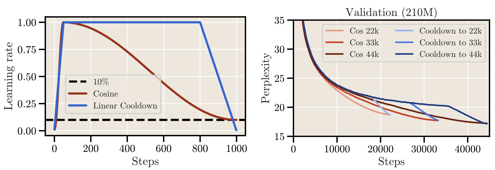
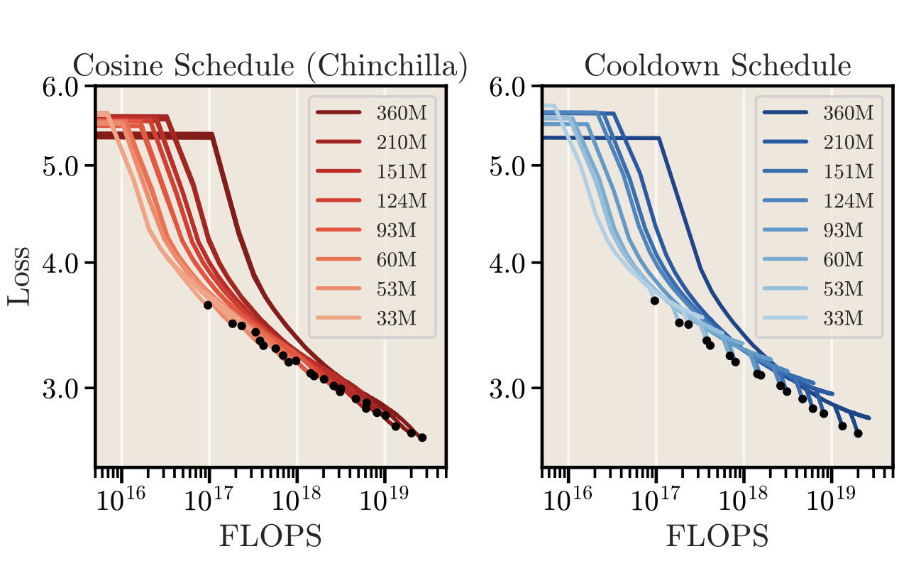
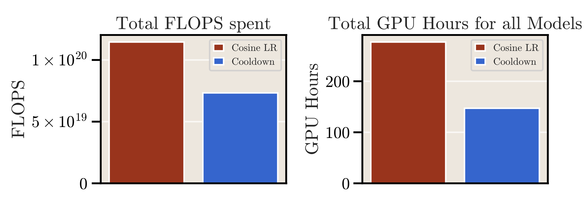

# Codebase: Scaling Laws and Compute-Optimal Training Beyond Fixed Training Durations
This is the codebase accompanying the paper [*Scaling Laws and Compute-Optimal Training Beyond Fixed Training Durations*](https://arxiv.org/abs/2405.18392). The code is largely based on our framework [llm-baselines](https://github.com/epfml/llm-baselines) to do research on training LLMs as an extension of [NanoGPT](https://github.com/karpathy/nanogpt).

**Abstract:**
> Scale has become a main ingredient in obtaining strong machine learning models. As a result, understanding a model's scaling properties is key to effectively designing both the right training setup as well as future generations of architectures. In this work, we argue that scale and training research has been needlessly complex due to reliance on the cosine schedule, which prevents training across different lengths for the same model size. We investigate the training behavior of a direct alternative - constant learning rate and cooldowns - and find that it scales predictably and reliably similar to cosine. Additionally, we show that stochastic weight averaging yields improved performance along the training trajectory, without additional training costs, across different scales. Importantly, with these findings we demonstrate that scaling experiments can be performed with significantly reduced compute and GPU hours by utilizing fewer but reusable training runs.

<p align="center">
  
</p>

**Figure:** Whereas the cosine learning rate follows a slow annealing, the alternative schedule of constant LR + cooldown is characterized by a fast drop towards the end of training. This cooldown phase initiates a sharp decrease in loss to match cosine; the training perplexity follows the same behavior.

<p align="center">
  
  
</p>

**Figure:** The cooldown schedule allows to perform scaling law experiments for a fraction of the compute. Instead of having to train from scratch (cosine), we launch one long run and perform cooldowns from intermediate checkpoints after training.


## Quickstart 

Create a conda environment and install dependencies (we recommend Python 3.10):

```bash
conda create -n env python=3.10
conda activate env
pip install -r requirements.txt
```

Run a simple training on the SlimPajama 6B dataset:
```bash
python ./src/main.py
```

The above command trains a 213.34M parameters model with the Llama-style architecture. We recommend to use the `--compile` flag that speeds up training noticeably (up to 20% in our setup).

## LR Schedules and Weight Averaging
In order to use the cooldown schedule:
```bash
python ./src/main.py --compile --scheduler wsd --wsd-fract-decay 0.2
```
The argument `wsd-fract-decay` controls the fraction of the cooldown phase, and the functional form of the cooldown is handled with the argument `decay-type`.

If you want to use stochastic weight averaging:
```bash
python ./src/main.py --compile --scheduler wsd --wsd-fract-decay 0.2 --weight-average
```
With this, the averaging is done automatically in slots of 500 steps; the model averages are all stored (beware of the disk space). The frequency is handled via the arguments `--wa-interval` (average every k steps) and `--wa-horizon` (the length of the horizon/window).

Moreover, the argument `wa-sweep-horizon` helps to automatically sweep the horizon to find the best performance, but may slow down training.

## FLOPS helpers
The [`flops.ipynb`](flops.ipynb) provides a few helpers and functionalities for FLOPS computations of transformer configurations.

# Contact & Reference
Please do not hesitate to reach out to us if you have questions!

In order to cite this work:
```
@article{hagele2024scaling,
  Author        = {Alexander Hägele and Elie Bakouch and Atli Kosson and Loubna Ben Allal and Leandro Von Werra and Martin Jaggi},
  Title         = {Scaling Laws and Compute-Optimal Training Beyond Fixed Training
    Durations},
  Eprint        = {2405.18392v1},
  ArchivePrefix = {arXiv},
  PrimaryClass  = {cs.LG},
  Year          = {2024},
  Month         = {May},
  Url           = {http://arxiv.org/abs/2405.18392v1},
  File          = {2405.18392v1.pdf}
}
```


